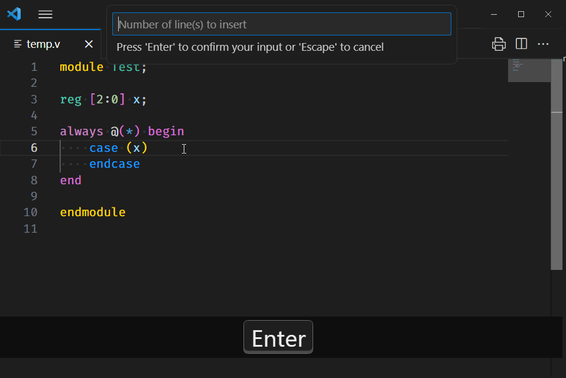
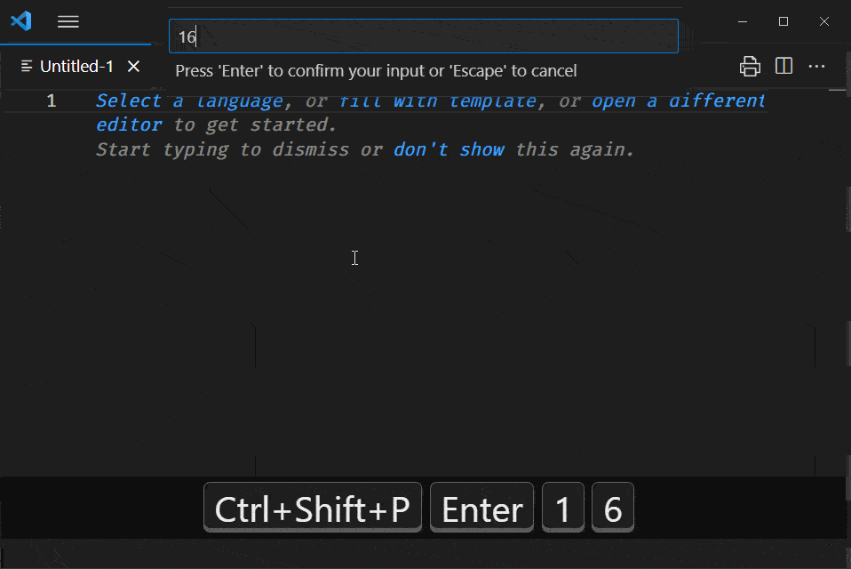
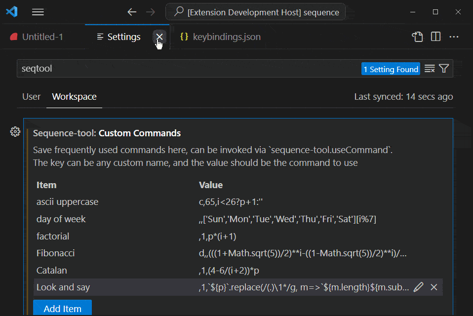

# Sequence Tool

The [Sequence Tool]() extension for Visual Studio Code allows you to easily insert custom sequences with a live preview.

## Features



---

### Insert Custom Sequence With Multi-cursors - `sequence-tool.insertSequence`

To insert a custom sequence using multi-cursors, use the following keyboard shortcut:

- Windows/Linux: <kbd>Ctrl</kbd> + <kbd>Alt</kbd> + <kbd>0</kbd>,
- Mac: <kbd>Cmd</kbd> + <kbd>Alt</kbd> + <kbd>0</kbd>

**Note**: Linebreak insertion is not supported with this command. Instead, use `sequence-tool.insertNLinesAfter`.

---

### Insert N Lines After Cursors - `sequence-tool.insertNLinesAfter`

This command allows you to insert N lines after the cursor(s) and creates N new cursors on each line inserted.

---

### Use Previous Saved Commands - `sequence-tool.useCommand`

You can defined custom commands from the settings ` sequence-tool.customCommands`. These commands will be accessible through the `sequence-tool.useCommand` command and can be invoked via keybindings.

## Example



### 1. Basic Usage

- To create a basic sequence, simply use the [initial value](#init):

  ```
  42           // 42, 43, 44, 45, ...
  ```

### 2. Padding

- Add padding to the sequence using the following syntax:

  ```
  #<5,42       // 42###, 43###, ...
  ```

### 3. Step

- To create a sequence with custom step size, use the [third parameter](#expr):

  ```
  #<5,42,p+0.3 // 42.0#, 42.3#, 42.6#, ...
  ```

### 4. Base conversion

- Binary number with 0 padding uses 2's complement for negative numbers:

  ```
  04b,-3       // 1101, 1110, 1111, 0000, 0001, ...
  ```

- ASCII/Unicode representation:

  ```
  c,65         // A, B, C, D, E, ...
  ```

### 5. Other Practical Use

- Repeated character N times:

  ```
  #>3,,''      // ###, ###, ###, ...
  ```

- Cyclic and repeated values:

  ```
  ,,'123'[(i/4|0)%3] // 1,1,1,1, 2,2,2,2, 3,3,3,3, 1,...
  ```

- [Spreadsheet column names](#init):

  ```
  AZ           // AZ, BA, BB, BC, ...
  ```

- Early stopping:

  ```
  ,,i<5?p+1:'' // 0, 1, 2, 3, 4, 5 (index starts from 1 after init)
  ```

### 6. Custom Sequence

- Using the previous value in the sequence (similar to `Array.prototype.reduce`):

  `,1,p*2` (Power of 2)

- Cyclic pattern using an index (0-based):

  `,,['Sun','Mon','Tue','Wed','Thu','Fri','Sat'][i%7]`

- Using both the previous value and index:

  `,1,p*(i+1)` (factorial)

- Fibonacci sequence: `d,,(((1+Math.sqrt(5))/2)**i-((1-Math.sqrt(5))/2)**i)/Math.sqrt(5)`

- Catalan number: `,1,(4-6/(i+2))*p`

  Alternatively: `,,(f=>f(f))(c=>x=>x?(4+6/~x)*(f=>f(f))(c)(x-1):1)(i)`

- Look and say sequence: `` ,1,`${p}`.replace(/(.)\1*/g, m=>`${m.length}${m.substring(0, 1)}`)  ``

## Command Syntax

The extension supports a variety of formatting options using a subset of Python's format specification mini-language. The syntax for the command is as follows:

```
[[[fillChar]align][width][.prec][spec]],[init],[expr]
```

The command can either contain only the `[init]` field or separate the possibly empty field with `,`.

| Field        | Definition                                                                                           |
| :----------- | :--------------------------------------------------------------------------------------------------- |
| **fillChar** | Character used to pad to the given width. The alignment must be specified, excpet for `fillChar=0`.  |
| **align**    | Use `>` for right-align and `<` for left-align within the available space.                           |
| **.prec**    | The number of digits to be displayed after the decimal point for the `f` spec.                       |
| **spec**     | Specifies how the value should be displayed (refer to details [below](#spec)).                       |
| **init**     | Initial value of sequence, defaults to 0 (see details [below](#init)).                               |
| **expr**     | The function `(p, i) => expr` generates the next value of the sequence. (see details [below](#expr)) |

#### Spec

The spec field allows you to customize how the sequence values are displayed.

Here are some format specifiers:

| Field                   | Definition                                                                 |
| :---------------------- | :------------------------------------------------------------------------- |
| **b**                   | Binary number.                                                             |
| **o**                   | Octal number.                                                              |
| **d**                   | Decimal integer number.                                                    |
| **h**,**x**,**H**,**X** | Hexadecimal number, use **H** or **X** for uppercase digits.               |
| **f**                   | Decimal fractional numbers.                                                |
| **c**                   | Converts to single Unicode character.                                      |
| **b\d+**                | Convert to other bases, can be 2 to 36 (For example: **b36** for base 36). |

#### Init

| Type                      | Definition                                      |
| :------------------------ | :---------------------------------------------- |
| **Number**                | Number literal, can be fractional.              |
| **English Letter**        | Generates the spreadsheet column name sequence. |
| **JavaScript Expression** | Any valid javascript expressions.               |

#### Expr

You can customize how the next value of the sequence is generated using the expr field. The function (p, i) => expr allows you to define the logic for generating the next value.

For example, to generate a sequence with a step size of 2, you can use (p, i) => p + 2.

| Parameter | Definition                                                  |
| :-------- | :---------------------------------------------------------- |
| **p**     | The previous value of the sequence, initalized by **init**. |
| **i**     | Zero-based index of the sequence.                           |

## Extension Settings

This extension contributes the following settings:

- `sequence-tool.customCommands`: Store your frequently used commands here. These commands will appear in the `sequence-tool.useCommand` command and can be invoked through keybindings.

### Example



Example Settings:

| Item                | Value                                                                    |
| :------------------ | :----------------------------------------------------------------------- |
| **ascii uppercase** | `c,65,i<26?p+1:''`                                                       |
| **day of week**     | `,,['Sun','Mon','Tue','Wed','Thu','Fri','Sat'][i%7]`                     |
| **factorial**       | `,1,p*(i+1)`                                                             |
| **Fibonacci**       | `d,,(((1+Math.sqrt(5))/2)**i-((1-Math.sqrt(5))/2)**i)/Math.sqrt(5)`      |
| **Catalan**         | `,1,(4-6/(i+2))*p`                                                       |
| **Look and say**    | `` ,1,`${p}`.replace(/(.)\1*/g, m=>`${m.length}${m.substring(0, 1)}`) `` |

## Keybindings

You can invoke commands through custom keybindings. Access the keybindings JSON by selecting Preferences: Open Keyboard Shortcuts (JSON).

Example keybindings for the factorial command and the preconfigured Catalan number command:

```json
// Execute a command (factorial) on keypress
{
   "key": "ctrl+alt+,",
   "command": "sequence-tool.insertSequence",
   "args": { "command": ",1,p*(i+1)" }
},
// Pick a preconfigured command (Catalan numbers) on keypress
{
  "key": "ctrl+alt+.",
  "command": "sequence-tool.useCommand",
  "args": { "name": "Catalan" }
}
```

## Release Notes

See [CHANGELOG.md](CHANGELOG.md).

## Special Thanks!

- Special thanks to [tomoki1207/vscode-input-sequence](https://github.com/tomoki1207/vscode-input-sequence) for the live preview functionality.
